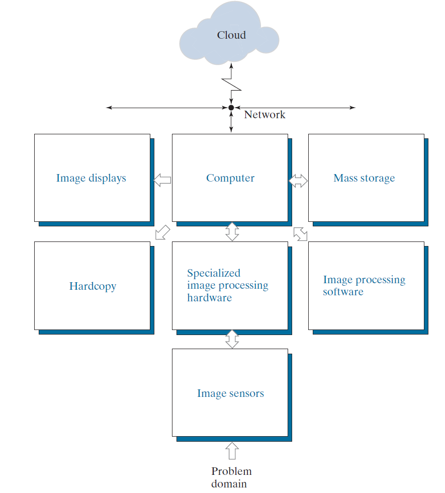

# Preview

The topics discussed are as follows

* Define the scope of the field that we call image processing.
* Present an overview of the state of the art in image processing by examining some of the principal areas in which it is applied
* Discuss briefly the principal approaches used in digital image processing.
* Give an overview of the components contained in a typical, general-purpose image processing system.

# Scope
Digital image definition as follows
$$f(x, y)$$

* $x$ and $y$ are spatial (plane) coordinates, and the amplitude of $f$ at any pair of coordinates $(x, y)$ is called the intensity or gray level of the image at that point.
* x, y, and the intensity values of $f$ are all *finite, discrete quantities*.

# Example of fields that use digital image processing
we categorize images according to their *source* to develop a basic understanding of image processing application.

## X-ray imaging
* **Principle**: X-ray tube is a vacuum tube with a ***cathode*** and ***anode***. The cathode is heated, causing free electrons to be released. These electrons flow at high speed to the positively charged anode. When the electrons strike a nucleus, energy is released in the form of X-ray radiation.
* **Application**:
  * Examine circuit boards for flaws, such as missing components or broken traces.
  * Computerized axial tomography (CAT). Each CAT image is a *slice* taken perpendicularly through the patient

## Visible Light
* Captures images using the visible spectrum.

## Infrared (IR)
IR radiation is an **electromagnetic wave** with wavelengths longer than visible light but shorter than microwaves.
Any objects with a temperature above zero emits infrared radiation as **thermal radiation**.

* **Night vision equipments**
* **Weather satellites**
* **Infrared telescope**
  * **Penetrating interstellar dust**: IR can pass through cosmic dust clouds, allowing observation of otherwise hidden celestial bodies (e.g., star-forming regions).
  * **Observing cool celestial objects**: Planets, interstellar dust, and distant galaxies primarily emit IR rather than visible light.
## Imaging In The Microwave Band
todo

# Fundamental Steps in Digital Image Process

* **Image acquisition**
  * Origin of digital images.
  * Basic digital image concepts.

* **Image enhancement**
  * Manipulation of an image to improve visual quality.
  * Introduction to new image processing methods through enhancement examples

* **Image restoration**
  * Improves the appearance of an image
  * Uses mathematical or probabilistic models to reverse image degradation.

* **Color image processing**
  * Fundamental concepts of color models and digital color processing.
  * Color is used for features extraction in images.

* **Wavelets**
  * Represents images at various resolutions.
  * Used in image compression and pyramidal representation (progressive image subdivision).

* **Compression**
  * Reduces storage size and transmission bandwidth.
  
* **Morphological processing**
  * Extracts image components useful for shape representation and description..

* **Segmentation**
  * Partitions an image into its constituent regions or objects

* **Feature extraction**
  * Extracts key characteristics from segmented regions.
  * ***Feature detection*** Identifies relevant image features.
  * ***Feature description*** Assigns quantitative attributes to detected features.

* ***Image pattern classification***
  * Assigns labels (e.g., “vehicle”) based on feature descriptors.
  * **Classical approaches**: Minimum-distance, correlation, Bayes classifiers.
  * **Modern approaches**: Deep neural networks.

# Components of an Image Processing System

