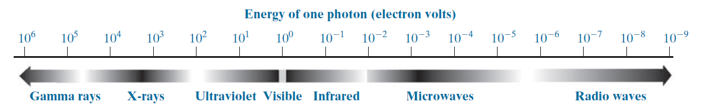
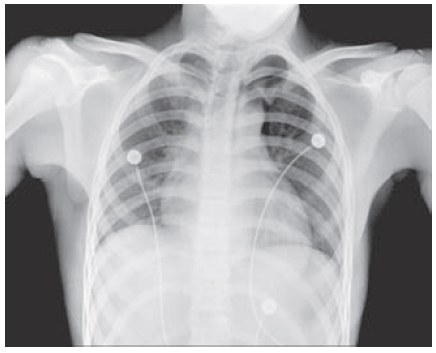

# Preview

The topics discussed are as follows

* define the scope of the field that we call image processing.
* give a historical perspective of the origins of this field.
* to present an overview of the state of the art in image processing by examining some of the principal areas in which it is applied
* discuss briefly the principal approaches used in digital image processing.
* give an overview of the components contained in a typical, general-purpose image processing system.

# Scope
Digital image definition as follows
$$f(x, y)$$

* $x$ and $y$ are spatial (plane) coordinates, and the amplitude of $f$ at any pair of coordinates $(x, y)$ is called the intensity or gray level of the image at that point.
* x, y, and the intensity values of $f$ are all *finite, discrete quantities*.

# Example of fields that use digital image processing
we categorize images according to their *source* to develop a basic understanding of image processing application.

## X-ray imaging
* **Principle**: X-ray tube is a vacuum tube with a ***cathode*** and ***anode***. The cathode is heated, causing free electrons to be released. These electrons flow at high speed to the positively charged anode. When the electrons strike a nucleus, energy is released in the form of X-ray radiation.
* **Application**:
  * Examine circuit boards for flaws, such as missing components or broken traces.
  * Computerized axial tomography (CAT). Each CAT image is a *slice* taken perpendicularly through the patient

## Visible Light
* Captures images using the visible spectrum.

## Infrared (IR)
IR radiation is an **electromagnetic wave** with wavelengths longer than visible light but shorter than microwaves.
Any objects with a temperature above zero emits infrared radiation as **thermal radiation**.

* **Night vision equipments**
* **Weather satellites**
* **Infrared telescope**
  * **Penetrating interstellar dust**: IR can pass through cosmic dust clouds, allowing observation of otherwise hidden celestial bodies (e.g., star-forming regions).
  * **Observing cool celestial objects**: Planets, interstellar dust, and distant galaxies primarily emit IR rather than visible light.
## Imaging In The Microwave Band
todo

# Fundamental Steps in Digital Image Process

* **Image acquisition**
  * regarding the origin of digital images.
  * introduce a number of basic digital
  image concepts.

* **Image enhancement**
  * process of manipulating an image
  * Using examples from image enhancement to introduce new image processing methods

* **Image restoration**
  * deals with improving the appearance of
  an image
  * restoration techniques tend to be based on mathematical or probabilistic models of image degradation

* **Color image processing**
  * fundamental concepts in color models and basic color processing in a digital domain
  * Color is used also as the basis for extracting features of interest in an image.

* **Wavelets**
  * foundation for representing images in various degrees of resolution.
  * In particular, for image data compression and for pyramidal representation, in which images are subdivided successively into smaller regions

* **Compression**
  * techniques for reducing the storage required to save an image, or the bandwidth required to transmit it.
  
* **Morphological processing**
  * extracting image components that are useful in the representation and description of shape.

* **Segmentation**
  * partitions an image into its constituent parts or objects

* **Feature extraction**
  * follows the output of a segmentation stage, which usually is raw pixel data, constituting either the boundary of a region or all the points in the region itself.
  * ***Feature detection*** refers to finding the features in an image, region, or boundary.
  * ***Feature description*** assigns quantitative attributes to the detected features.

## Photography

### Analog photography (chemical)
* ***Full-frame***: Standard film size; traditional 135 film has a standard lens
* **Types of film**: Black & white, color, infrared.

### digital photography (electronic)
Digital photography converts light energy into digital images using **CCD** or **CMOS** sensors.

* **CCD (Charge-Coupled Device)**
  * Made of silicon semiconductor.
* **CMOS (Complementary Metal–Oxide–Semiconductor)**
  * primarily uses *silicon* and *germanium*. 
  * Dominates due to affordability and low power consumption