# Preview
This chapter is an introduction to a number of basic concepts in digital image processing.

The topics discussed are as follows

* Important aspects of the human visual system
* Light, other components of the electromagnetic spectrum, and their imaging characteristics
* Imaging sensors and how they are used to generate digital images.
* The concepts of uniform image sampling and intensity quantization.
* Digital image representation, the effects of varying the number of samples and intensity levels in an image.
* Variety of basic relationships between pixels.

# Elements of Visual Perception
The human eye uses ***cons*** for color and sharp vision bright light and ***rods*** for black-and-light, motion sensitive vision in the dark.

| Feature                | Cones                       | Rods                            |
| ---------------------- | --------------------------- | ------------------------------- |
| **Function**           | Color vision & details      | Night vision & motion detection |
| **Best in**            | Bright light                | Low light                       |
| **Location**           | Fovea (center of retina)    | Peripheral retina               |
| **Number**             | ~6 million                  | ~120 million                    |
| **Color Sensitivity**  | Yes (RGB: red, green, blue) | No (monochrome)                 |
| **Light Sensitivity**  | Low                         | High                            |
| **Sharpness (Acuity)** | Low                         | Low                             |

# Light And the Electromagnetic Spectrum
 * **Shorter wavelengths**: High frequency, stronger energy, shorter distance.
* **Longer wavelengths**: Lower frequency, weaker energy, longer distance.
 * Each massless particle contains a certain amount (or bundle) of energy, called a ***photon***.

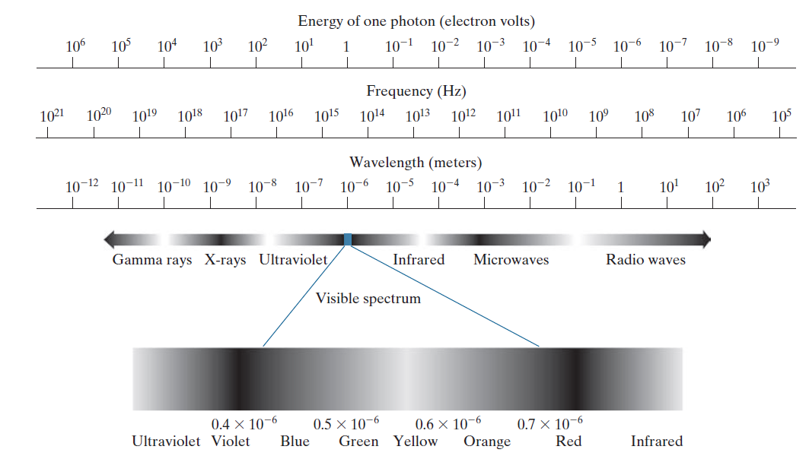

The electromagnetic spectrum can be expressed in terms of wavelength, frequency, or energy. Wavelength ($\lambda$) and frequency ($v$) are related by the expression

$${\lambda = }{c \over v}$$

where $c$ is the speed of light (2.998 * 108 m/s).

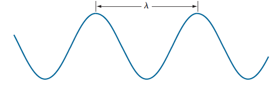

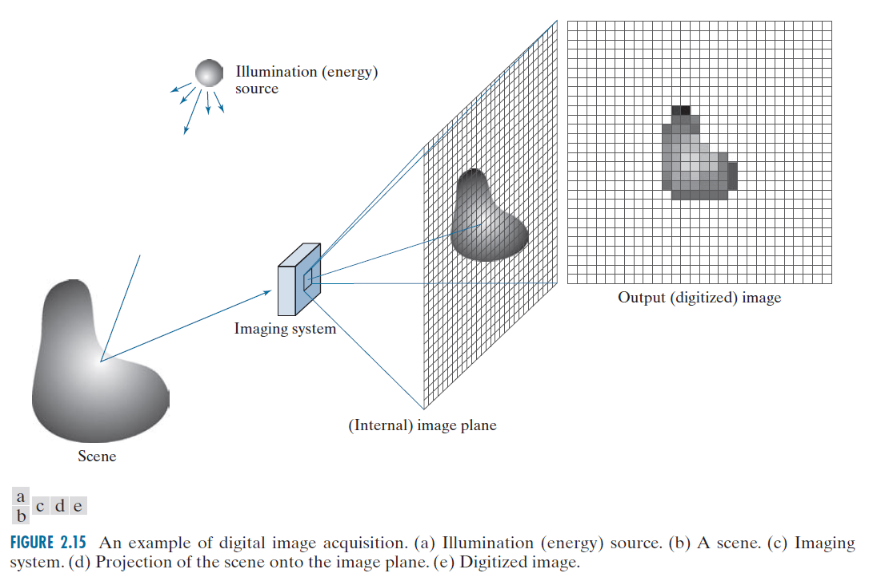
# Image Sensing And Acquisition

***Three principal sensor arrangements*** (single、line and array) used to transform energy into digital images.

**Idea:** Incoming energy is transformed
into a voltage by **input electrical power** and **sensor material**

## Sensor

A familiar sensor of this type is the ***photodiode***, which is constructed from ***silicon*** materials and generates an output current proportional to light intensity (*analog signal*)

###  Application

* **CCD (Charge-Coupled Device)**
  * Made of silicon semiconductor.
  * Uses an array of ***photodiodes*** to capture light and transfers charge sequentially to an output amplifier
* **CMOS (Complementary Metal–Oxide–Semiconductor)**
  * Made primarily of *silicon*
  * Integrates ***photodiodes*** with ***amplifiers*** and readout circuits within each pixel.
  * Dominates due to affordability, low power consumption, and faster readout speeds.

## Sensor arrangements

### Single sensing element
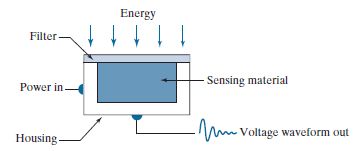

* Generating 2-D image
  * ***Film negative*** is mounted onto a drum whose mechanical rotation provides displacement in one dimension.
  * The sensor is mounted on a lead screw
that provides motion in the perpendicular direction
  * A light source is contained inside the drum. **As the light passes through the film, its intensity is modified by the film density before it is captured by the sensor**

* 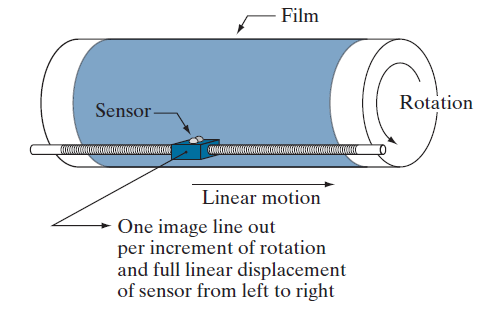
* Line sensor
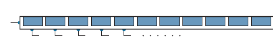
* Array sensor
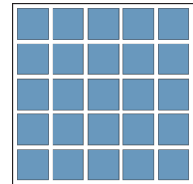

# Image Sampling And Quantization
* ***sampling***: Digitizing the *coordinate* values
* ***quantization***: Digitizing the
*amplitude* values

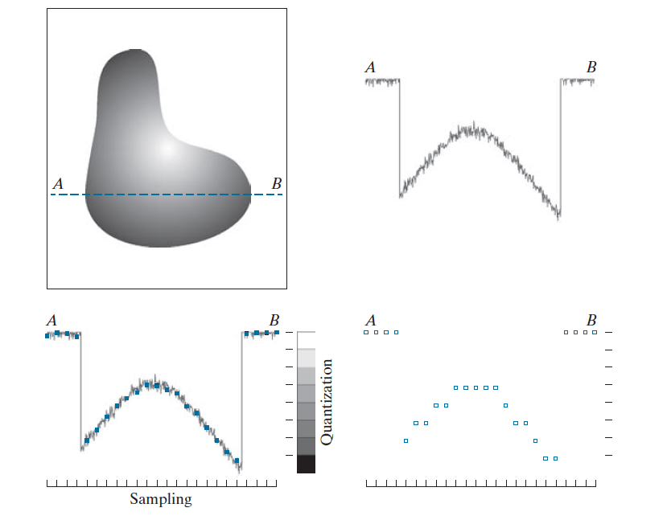

## Representing Digital Images

**Representation** of an M * N numerical array

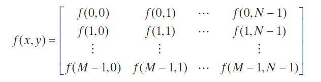
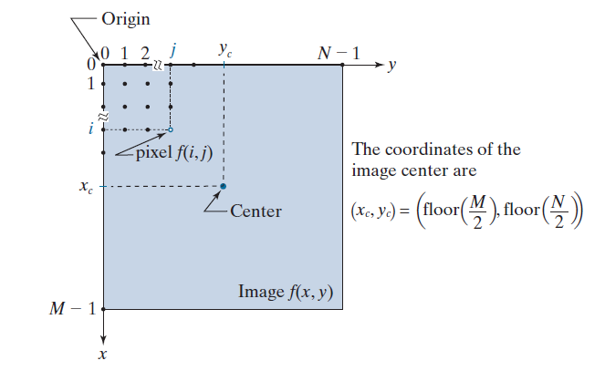

**k-bit image storage requirement**

The number, $b$, of bits required to store a digital image is
$$b = M * N * k$$
When $M = N$, this equation becomes
$$b = N^2k$$
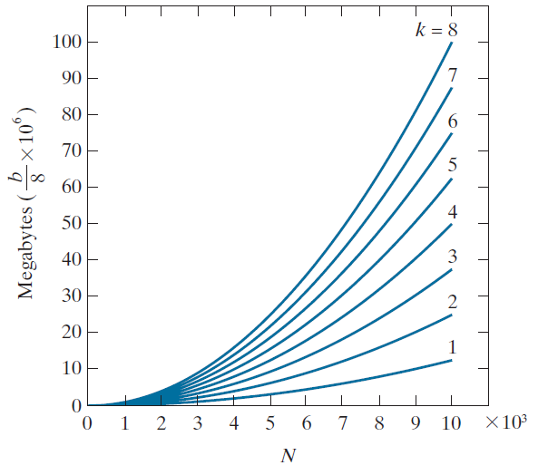

**spatial resolution**
measure of the smallest discernible detail in an image.

# Some Basic Relationships Between Pixels

## Neighbors of a pixel

## Adjacency, Connectivity, Regions, And Boundaries

* 4-$adjacency$. Two pixels $p$ and $q$ with values from $V$ are 4-$adjacent$ if $q$ is in the
set $N_4(p)$
* 8-$adjacency$. Two pixels $p$ and $q$ with values from $V$ are 8-$adjacent$ if $q$ is in the
set $N_8(p)$
* m-$adjacency$ (also called $mixed$ $adjacency$). Two pixels $p$ and $q$ with values from $V$ are m-$adjacent$ if
  * $q$ is in $N_4(p)$, or
  * $q$ is in $N_D(p)$ and the   set $N_4(p)\cap N_4(q)$ has no pixels whose values are from $V$

