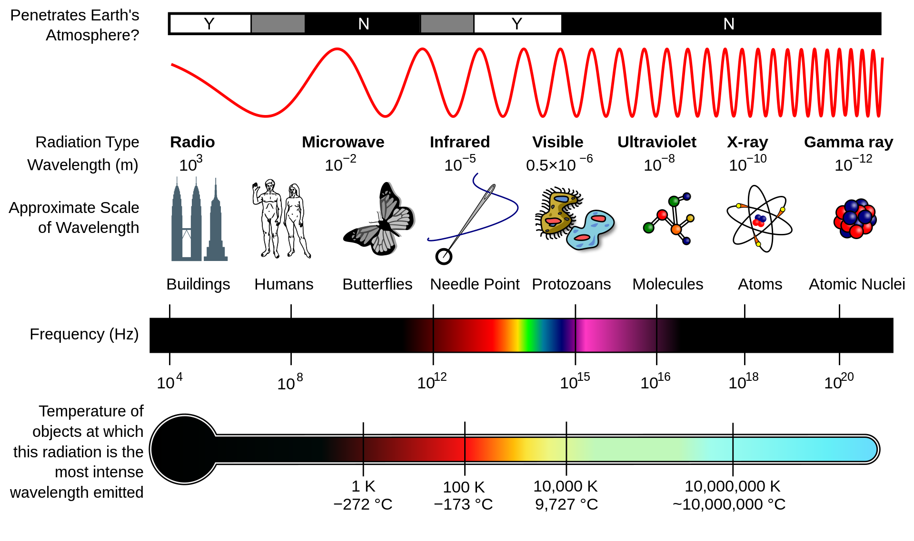

## From analog to digital
## Spectrum
* **Shorter wavelengths**: High frequency, stronger energy, shorter distance.
* **Longer wavelengths**: Lower frequency, weaker energy, longer distance.

## Photography

### Analog photography (chemical)
* ***Full-frame***: Standard film size; traditional 135 film has a standard lens
* **Types of film**: Black & white, color, infrared.

### digital photography (electronic)
Digital photography converts light energy into digital images using **CCD** or **CMOS** sensors.

* **CCD (Charge-Coupled Device)**
  * Made of silicon semiconductor.
* **CMOS (Complementary Metal–Oxide–Semiconductor)**
  * primarily uses *silicon* and *germanium*. 
  * Dominates due to affordability and low power consumption
  
## Type of digital images
### X-ray
* can penetrate solid substances, including construction materials and living tissue.
* Used in:
  * Fabrication: Non-Destructive Testing (NDT) or measuring dimensions.

### Visible Light
* Captures images using the visible spectrum.

### Infrared (IR)
IR radiation is an **electromagnetic wave** with wavelengths longer than visible light but shorter than microwaves.
Any objects with a temperature above zero emits infrared radiation as **thermal radiation**.

* **Night vision equipments**
* **Weather satellites**
* **Infrared telescope**
  * **Penetrating interstellar dust**: IR can pass through cosmic dust clouds, allowing observation of otherwise hidden celestial bodies (e.g., star-forming regions).
  * **Observing cool celestial objects**: Planets, interstellar dust, and distant galaxies primarily emit IR rather than visible light.

### Satellite imagery
* Uses various spectral bands (visible, IR, microwave) to capture Earth's surface and atmosphere.
  
### Ultrasound
* Uses high-frequency sound waves to create images of internal structures (e.g., medical imaging, industrial testing).

