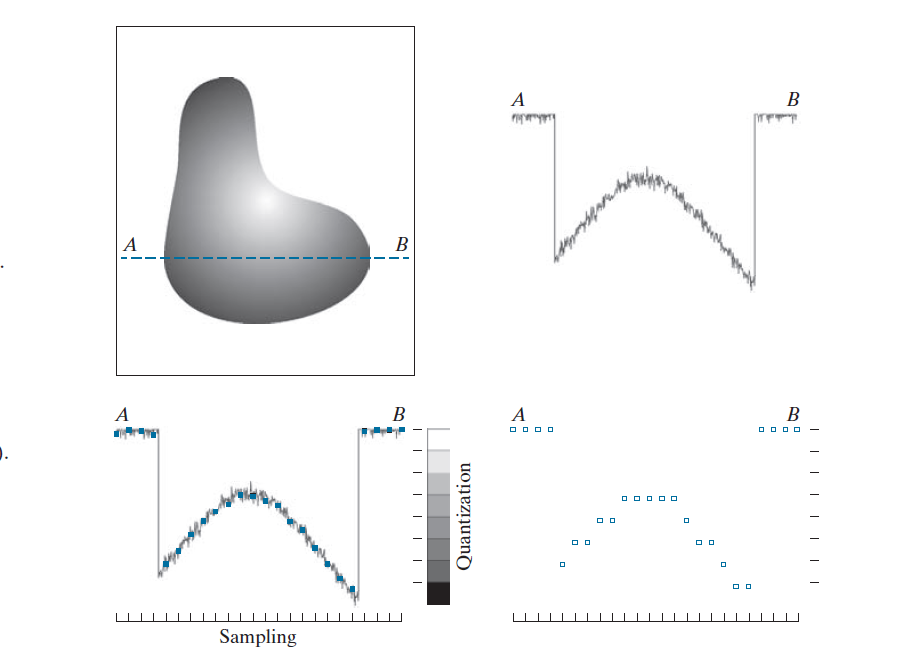

## human eye
The human eye uses *cons* for color and sharp vision bright light and *rods* for black-and-light, motion sensitive vision in the dark.

| Feature                | Cones                       | Rods                            |
| ---------------------- | --------------------------- | ------------------------------- |
| **Function**           | Color vision & details      | Night vision & motion detection |
| **Best in**            | Bright light                | Low light                       |
| **Location**           | Fovea (center of retina)    | Peripheral retina               |
| **Number**             | ~6 million                  | ~120 million                    |
| **Color Sensitivity**  | Yes (RGB: red, green, blue) | No (monochrome)                 |
| **Light Sensitivity**  | Low                         | High                            |
| **Sharpness (Acuity)** | Low                         | Low                             |

## image sensing
visible light 430um~790um (nanometers 10^-9 m)
* illumination (lumens)
* Brightness
* Reflection

### Sensor arrangement
* Single
* Sensor Stripes (Line sensor)
* Sensor Arrays (Array sensor)
###

###  

