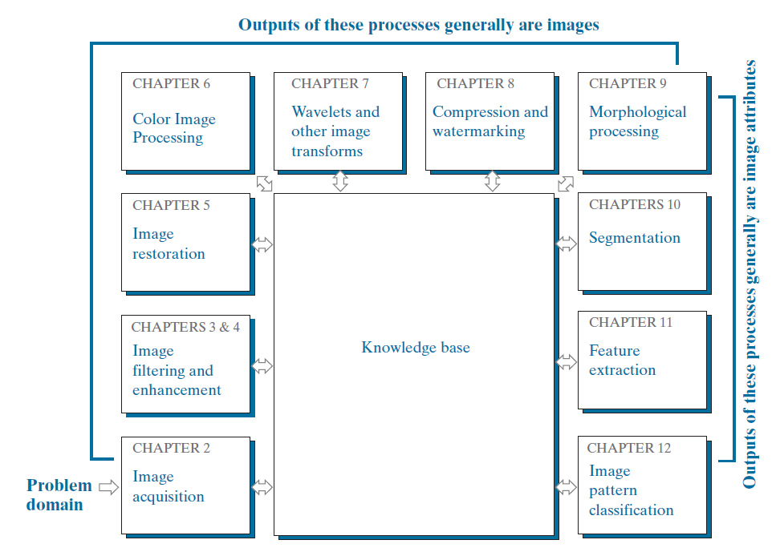

# Fundamental Steps in Digital Image Process

## 1. Image acquisition
* regarding the origin of digital images.
* introduce a number of basic digital
image concepts.

## 2. Image enhancement
* process of manipulating an image
* Using examples from image enhancement to introduce new
image processing methods

## 3. Image restoration
* deals with improving the appearance of
an image
* restoration techniques tend to be based on mathematical
or probabilistic models of image degradation

## 4. Color image processing
* fundamental concepts in color models and basic color processing in a digital domain
* Color is used also as the basis for extracting features of interest in an image.

## 5. Wavelets
* foundation for representing images in various degrees of resolution.
* In particular, for image data compression and for pyramidal representation, in which images are subdivided successively into smaller regions

## 6. Compression
* techniques for reducing the storage required to save an image, or the bandwidth required to transmit it.
  
## 7. Morphological processing
* extracting image components that
are useful in the representation and description of shape

## 8. Segmentation
* partitions an image into its constituent parts or objects

## 9. Feature extraction
* follows the output of a segmentation stage, which usually is raw pixel data, constituting either the boundary of a region or all the points in the region itself.
* ***Feature detection*** refers to finding the features in an image, region, or boundary.
* ***Feature description*** assigns quantitative attributes to the detected features.

## 10. Image pattern classification

* process that assigns a label (e.g., “vehicle”) to an
object based on its feature descriptors

